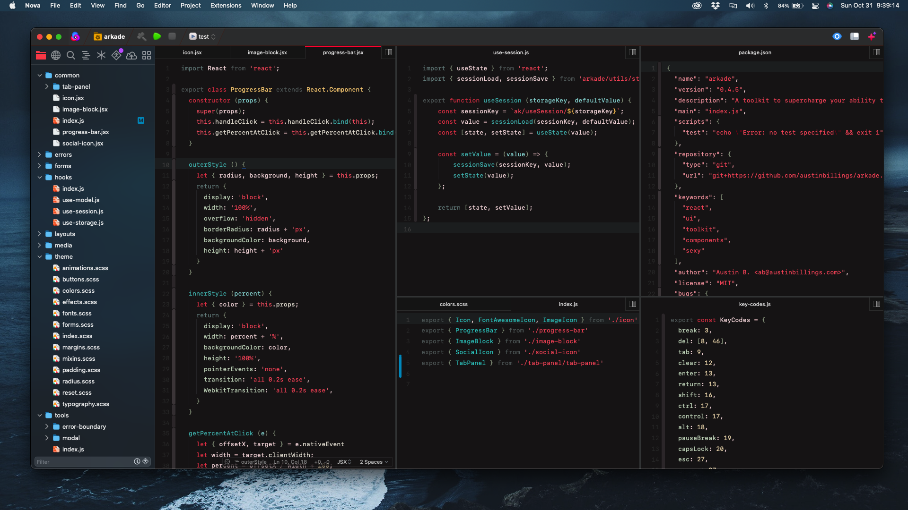

<!--
👋 Hello! As Nova users browse the extensions library, a good README can help them understand what your extension does, how it works, and what setup or configuration it may require.

Not every extension will need every item described below. Use your best judgement when deciding which parts to keep to provide the best experience for your new users.

💡 Quick Tip! As you edit this README template, you can preview your changes by selecting **Extensions → Activate Project as Extension**, opening the Extension Library, and selecting "Killer" in the sidebar.

Let's get started!
-->
# Killer Nova

## The Killer theme Firefox, Atom, and Sublime theme, now for Nova.

_Killer_ for Firefox, Atom, & Sublime, also by [Austin Billings](https://github.com/austinbillings).
